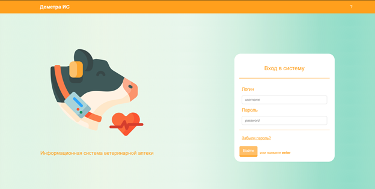
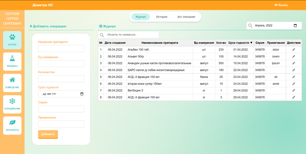
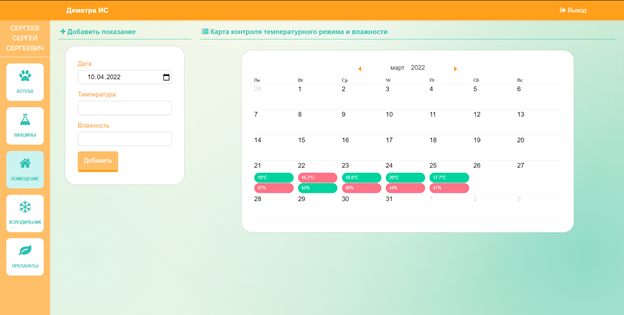

# DemetraIS #
## Information system for vet pharmacy ##
* Includes all the functionality necessary for logging the movement of drugs in a veterinary pharmacy, as well as monitoring compliance with humidity and temperature standards in the room and refrigerator; 
* Working on a WAMP stack
### Login page 

### Main window 

### Temperature & humidity monitoring page 

